[](https://docs.rs/cargo-ferris-wheel) [](https://crates.io/crates/cargo-ferris-wheel) [](https://github.com/Ellipsis-labs/cargo-ferris-wheel/actions/workflows/build.yaml)

# 🎡 Ferris Wheel

<div align="center">


**🎪 Step right up! Step right up! 🎪**  
_The greatest circular dependency detector in all the land!_

</div>

Find and fix circular dependencies in your Rust monorepo before they take you for a spin!

## 🎠 The Main Attractions

🎡 **Round and Round We Go** - Find cycles between workspaces before they make you dizzy  
🎯 **Ring Toss Champions** - Precisely target which tests to run in CI  
🎪 **The Amazing Affected Analysis** - Watch as we reveal which crates are impacted by your changes!  
🎨 **House of Formats** - Output for humans, robots, and everything in between (JSON, JUnit, GitHub Actions)  
🎢 **Thrill Ride Visualizations** - Draw dependency graphs in ASCII, Mermaid, DOT, or D2  
🚀 **Lightning-Fast Carousel** - Parallel processing with Rayon keeps the show moving  
🎟️ **CI-Friendly Admission** - Proper exit codes and machine-readable output for your automation needs  
📚 **Take It Home** - Use as a library in your own Rust carnival

## 🎪 When the Carnival Goes Wrong

Managing dependencies in a Rust monorepo is like running a carnival - one merry-go-round spinning the wrong way and suddenly you've got a three-ring circus of chaos! Without a skilled ringmaster, circular dependencies sneak in like carnival crashers and cause:

- **🎠 The Broken Carousel** - Cargo can't figure out which horse goes first in the build order
- **🏚️ Funhouse of Horrors** - Changes in one workspace trigger a hall of mirrors effect in others
- **🎢 The Dependency Roller Coaster** - Tools like [hakari](https://docs.rs/hakari/latest/hakari/) (which unifies dependencies across workspaces) can turn a gentle ride into a white-knuckle thrill when circular dependencies amplify throughout your entire midway

Here's what happens when your monorepo becomes a runaway Tilt-a-Whirl:


In this sideshow spectacular:

- **A → B → C → A** creates an endless loop-the-loop where passengers never get off the ride
- Any ticket punched at A, B, or C means the whole wheel starts spinning out of control
- Workspaces D, E, and F get **dragged along for the ride** like unsuspecting carnival-goers
- With hakari in the mix, one update sends the whole carnival into a **cotton-candy-sticky situation**, with dependency updates spreading like spilled soda on the midway

Ferris Wheel helps you **spot the troublemakers before opening day**, keeping your monorepo carnival running smoothly instead of becoming a house of cards!

## 🎟️ Get Your Ticket to Ride

Step right up and install your very own Ferris Wheel operator's license:

```bash
# If you have cargo-binstall installed:
cargo binstall cargo-ferris-wheel

# Otherwise, you can compile and install it from crates.io:
cargo install cargo-ferris-wheel
```

_No carnival experience required! Operators standing by!_

## 🎪 Operating Instructions

### 🎡 Inspect - Spot the Dizzy Riders (Find Circular Dependencies)

The `inspect` command is your primary tool for detecting circular dependencies in your Rust monorepo. It analyzes your workspace dependency graph and identifies cycles that can cause build failures and complicate dependency management.

**What it does:**

- Scans all Cargo.toml files in your workspace
- Builds a complete dependency graph
- Uses Tarjan's algorithm to find strongly connected components (cycles)
- Reports all circular dependency chains with detailed paths
- Supports multiple output formats for CI integration

**When to use it:**

- As a pre-commit hook to prevent cycles from entering your codebase
- In CI pipelines to catch cycles early
- During refactoring to ensure you haven't introduced new cycles
- When debugging build order issues

```bash
# Inspect current directory for inter-workspace cycles
cargo ferris-wheel inspect

# Inspect for cycles within workspaces (intra-workspace)
cargo ferris-wheel inspect --intra-workspace

# Inspect specific paths
cargo ferris-wheel inspect path/to/workspace

# Output in different formats
cargo ferris-wheel inspect --format json
cargo ferris-wheel inspect --format junit
cargo ferris-wheel inspect --format github

# Fail CI if cycles are found
cargo ferris-wheel inspect --error-on-cycles

# Limit number of cycles displayed
cargo ferris-wheel inspect --max-cycles 5
```

### 🎯 Lineup - The Dependency Ring Toss (Understand Your Dependencies)

The `lineup` command reveals the dependency relationships between workspaces in your monorepo. Like skilled ring toss performers, it shows you exactly which workspaces connect to others, helping you understand your project's architecture.

**What it does:**

- Lists all dependencies for each workspace
- Shows reverse dependencies (what depends on a workspace)
- Traces transitive dependencies through the graph
- Identifies standalone workspaces with no dependencies
- Provides clear visualization of your monorepo structure

**When to use it:**

- Planning refactoring efforts by understanding impact
- Identifying which workspaces to test when making changes
- Finding unused or isolated workspaces
- Understanding the dependency hierarchy in your project
- Generating dependency documentation

```bash
# Show all workspace dependencies
cargo ferris-wheel lineup

# Show dependencies for a specific workspace
cargo ferris-wheel lineup --workspace core

# Show reverse dependencies (what depends on this workspace)
cargo ferris-wheel lineup --workspace core --reverse

# Show transitive dependencies
cargo ferris-wheel lineup --workspace core --transitive

# Output as JSON for CI integration
cargo ferris-wheel lineup --format json
```

### 🎢 Ripples - The Ripple Effect Roller Coaster (Track Change Impact)

The `ripples` command is the star of our CI circus! This precision tool determines exactly which workspaces and crates are affected by file changes, enabling smart build and test strategies that save time and resources.

**What it does:**

- Maps changed files to their containing crates
- Canonicalizes crates by their manifest paths so duplicate package names stay unique across workspaces
- Traces dependencies to find all affected components
- Distinguishes between directly and indirectly affected crates
- Provides both workspace and crate-level impact analysis
- Resolves workspace dependencies via Cargo metadata rather than directory-name heuristics
- Outputs machine-readable formats for CI integration

**When to use it:**

- In CI pipelines to determine what needs to be built/tested
- During code review to understand change impact
- For incremental builds in large monorepos
- When planning deployment strategies
- To optimize test execution based on actual changes

**Why it's powerful:**
Unlike naive approaches that rebuild everything or guess based on directory names, `ripples` understands your actual dependency graph. It precisely identifies affected components, even when:

- Multiple crates exist in a single workspace
- Different workspaces reuse the same crate name
- Changes affect shared dependencies
- Workspace directories diverge from their package names
- File moves or renames occur
- Only test files are modified

```bash
# Show what's affected by changed files
cargo ferris-wheel ripples src/lib.rs tests/integration.rs

# Include crate-level information in output
cargo ferris-wheel ripples src/lib.rs --show-crates

# Show only directly affected crates (no reverse dependencies)
cargo ferris-wheel ripples src/lib.rs --direct-only

# Output as JSON for CI integration
cargo ferris-wheel ripples src/lib.rs --format json

# Multiple files can be specified as positional arguments
cargo ferris-wheel ripples src/lib.rs src/main.rs Cargo.toml

# Exclude specific dependency types from analysis
cargo ferris-wheel ripples src/lib.rs --exclude-dev
cargo ferris-wheel ripples src/lib.rs --exclude-build --exclude-target
```

Example JSON output:

```json
{
  "affected_crates": [
    {
      "name": "my-lib",
      "workspace": "core",
      "is_directly_affected": true
    },
    {
      "name": "my-app",
      "workspace": "apps",
      "is_directly_affected": false
    }
  ],
  "affected_workspaces": [
    {
      "name": "core",
      "path": "/home/user/monorepo/core"
    },
    {
      "name": "apps",
      "path": "/home/user/monorepo/apps"
    }
  ],
  "directly_affected_crates": ["my-lib"],
  "directly_affected_workspaces": [
    {
      "name": "core",
      "path": "/home/user/monorepo/core"
    }
  ]
}
```

### 🔍 Spotlight - The Crate Magnifying Glass Act (Focus on One Crate)

The `spotlight` command zooms in on a specific crate, revealing all circular dependencies that involve it. When you need to understand why a particular crate is tangled in dependency cycles, this focused analysis provides clarity.

**What it does:**

- Filters cycle detection to show only cycles containing the specified crate
- Shows the complete cycle paths involving that crate
- Works for both inter-workspace and intra-workspace analysis
- Helps isolate and debug specific problematic dependencies
- Provides targeted information for fixing individual crates

**When to use it:**

- Debugging why a specific crate won't compile due to cycles
- Understanding a crate's role in circular dependencies
- Planning how to refactor a problematic crate
- Investigating legacy code with complex dependencies
- Focusing remediation efforts on high-priority crates

```bash
# Find all cycles involving a specific crate
cargo ferris-wheel spotlight my-crate

# Analyze intra-workspace cycles for a crate
cargo ferris-wheel spotlight my-crate --intra-workspace

# Output in different formats
cargo ferris-wheel spotlight my-crate --format json
```

### 🎨 Spectacle - The Dependency Art Show (Visualize Your Architecture)

The `spectacle` command transforms your dependency graph into beautiful visualizations. Whether you need ASCII art for your terminal, Mermaid diagrams for documentation, or professional graphs for presentations, this command delivers stunning visual representations of your monorepo structure.

**What it does:**

- Generates visual dependency graphs in multiple formats
- Highlights circular dependencies in contrasting colors
- Groups workspaces by common prefixes for clarity
- Shows crate counts and dependency types
- Creates interactive diagrams with hover information (Mermaid)
- Produces publication-ready visualizations

**Supported formats:**

- **ASCII**: Terminal-friendly box diagrams
- **Mermaid**: Web-ready interactive diagrams for documentation
- **DOT**: Graphviz format for high-quality renders
- **D2**: Modern diagramming language for beautiful layouts

**When to use it:**

- Creating architecture documentation
- Presenting monorepo structure to teams
- Debugging complex dependency relationships
- Code review and design discussions
- Identifying architectural improvements
- Generating diagrams for README files

```bash
# Generate ASCII graph
cargo ferris-wheel spectacle

# Generate Mermaid diagram
cargo ferris-wheel spectacle --format mermaid -o deps.mmd

# Generate DOT file for Graphviz
cargo ferris-wheel spectacle --format dot -o deps.dot

# Highlight cycles in the graph
cargo ferris-wheel spectacle --highlight-cycles
```

### 🎪 See the Show in Action

Step right up and witness the spectacular Mermaid diagram performance, generated by our very own `cargo ferris-wheel spectacle --format mermaid` for a hypothetical Rust carnival grounds:

```mermaid
graph TD

    subgraph app_group["app"*]
        app_backend(("app-backend\n3 crates"))
        click app_backend "Workspace: app-backend - Crates: backend-api, backend-service, backend-db - Total: 3"
        style app_backend fill:#FFF3E0,stroke:#F57C00,stroke-width:3px
        app_frontend["app-frontend\n2 crates"]
        click app_frontend "Workspace: app-frontend - Crates: frontend-ui, frontend-state - Total: 2"
        style app_frontend fill:#E3F2FD,stroke:#1976D2,stroke-width:2px
        app_worker["app-worker\n2 crates"]
        click app_worker "Workspace: app-worker - Crates: worker-jobs, worker-scheduler - Total: 2"
        style app_worker fill:#E3F2FD,stroke:#1976D2,stroke-width:2px
    end

    subgraph core_group["core"*]
        core_runtime(("core-runtime\n2 crates"))
        click core_runtime "Workspace: core-runtime - Crates: runtime, runtime-types - Total: 2"
        style core_runtime fill:#FFF3E0,stroke:#F57C00,stroke-width:3px
        core_storage["core-storage\n2 crates"]
        click core_storage "Workspace: core-storage - Crates: storage, storage-api - Total: 2"
        style core_storage fill:#E3F2FD,stroke:#1976D2,stroke-width:2px
        core_rpc["core-rpc\n2 crates"]
        click core_rpc "Workspace: core-rpc - Crates: rpc-server, rpc-client - Total: 2"
        style core_rpc fill:#E3F2FD,stroke:#1976D2,stroke-width:2px
    end

    subgraph tools_group["tools"*]
        tools_cli(["tools-cli\n1 crates"])
        click tools_cli "Workspace: tools-cli - Crates: cli - Total: 1"
        style tools_cli fill:#E3F2FD,stroke:#1976D2,stroke-width:2px
        tools_migrate(["tools-migrate\n1 crates"])
        click tools_migrate "Workspace: tools-migrate - Crates: migrate - Total: 1"
        style tools_migrate fill:#E3F2FD,stroke:#1976D2,stroke-width:2px
        tools_test_utils["tools-test-utils\n2 crates"]
        click tools_test_utils "Workspace: tools-test-utils - Crates: test-utils, test-fixtures - Total: 2"
        style tools_test_utils fill:#E3F2FD,stroke:#1976D2,stroke-width:2px
    end

    core_storage -->|storage → runtime| core_runtime
    linkStyle 0 stroke:#64B5F6,stroke-width:2px
    app_frontend -.->|frontend-ui → test-fixtures| tools_test_utils
    linkStyle 1 stroke:#90A4AE,stroke-width:2px
    tools_cli -->|cli → backend-api| app_backend
    linkStyle 2 stroke:#64B5F6,stroke-width:2px
    app_worker -->|worker-jobs → storage| core_storage
    linkStyle 3 stroke:#64B5F6,stroke-width:2px
    app_backend -->|backend-service → runtime| core_runtime
    linkStyle 4 stroke:#FF6500,stroke-width:3px
    core_rpc -->|rpc-server → runtime| core_runtime
    linkStyle 5 stroke:#64B5F6,stroke-width:2px
    app_worker -->|worker-scheduler → backend-service| app_backend
    linkStyle 6 stroke:#64B5F6,stroke-width:2px
    app_backend -->|backend-db → storage| core_storage
    linkStyle 7 stroke:#64B5F6,stroke-width:2px
    app_backend -.->|backend-service → test-utils| tools_test_utils
    linkStyle 8 stroke:#90A4AE,stroke-width:2px
    tools_migrate -->|migrate → storage| core_storage
    linkStyle 9 stroke:#64B5F6,stroke-width:2px
    core_runtime -.->|runtime → backend-service| app_backend
    linkStyle 10 stroke:#FF6500,stroke-width:3px
    app_backend -->|backend-api → rpc-server| core_rpc
    linkStyle 11 stroke:#64B5F6,stroke-width:2px
    app_frontend -->|frontend-ui → rpc-client| core_rpc
    linkStyle 12 stroke:#64B5F6,stroke-width:2px

    subgraph Legend
        L1[Normal Workspace]
        L2[Workspace in Cycle]
        style L1 fill:#E3F2FD,stroke:#1976D2,stroke-width:2px
        style L2 fill:#FFF3E0,stroke:#F57C00,stroke-width:3px
        style Legend fill:#FAFAFA,stroke:#ddd,stroke-width:1px
    end

    subgraph CycleSeverity["Cycle Severity"]
        CS1["⚠️ Cycle 1: 2 workspaces<br/>app-backend → core-runtime"]
        style CycleSeverity fill:#FAFAFA,stroke:#ddd,stroke-width:1px
    end
```



In this example:

- **Workspaces are grouped** by common prefixes (core, app, tools)
- **Nodes have different shapes** based on their characteristics:
  - Stadium shape `([])` for single-crate workspaces
  - Rectangle `[]` for large workspaces (>5 crates)
  - Double circle `(())` for workspaces in cycles
- **Colors indicate status**:
  - Blue (#E3F2FD) for normal workspaces
  - Orange (#FFF3E0) for workspaces involved in cycles
- **Edge styles** show dependency types:
  - Solid arrows `-->` for normal dependencies
  - Dashed arrows `-.->` for dev dependencies
  - Thick arrows `===>` for build dependencies
- **Icons** make it easy to see dependency types at a glance:
  - 📦 for normal dependencies
  - 🔧 for dev dependencies
  - 🏗️ for build dependencies
- **Cycle severity** is shown with warning levels:
  - ⚠️ Low severity (2 workspaces, mostly dev/build deps)
  - ⚠️ Medium severity (3-4 workspaces or mixed deps)
  - 🚨 High severity (5+ workspaces or mostly normal deps)
- **Interactive tooltips** - Click on any workspace node to see detailed information about its crates

## 🎭 Choose Your Souvenir Format

Take home a memento from your visit in any of these delightful formats:

- **🎨 Human** - A colorful carnival poster for your terminal
- **🤖 JSON** - Prize tokens for your automation games
- **📋 JUnit XML** - The universal carnival passport your CI understands
- **🎯 GitHub Actions** - Precision dart throws right into your PR

## 🏗️ Behind the Big Top (How It's Built)

Take a peek behind the curtain at our carnival machinery:

```
src/
├── main.rs, lib.rs, cli.rs    # The ticket booth and main entrance
├── analyzer/                  # The ride inspectors (parallel safety checks!)
├── commands/                  # The control panels for each attraction
├── config/                    # Ride configuration and safety settings
├── core/                      # The steel framework holding it all together
├── detector/                  # The dizzy-detector (Tarjan's spinning algorithm)
├── executors/                 # The ride operators who make it all happen
├── graph/                     # The carnival map artist's studio
├── reports/                   # The souvenir stand (take home your results!)
├── utils/                     # The toolbox for fixing loose bolts
└── workspace_discovery.rs     # The carnival grounds surveyor
```

## 🎫 VIP Passes & Exclusions

Skip the rides you're not interested in:

- `--exclude-dev` - Skip the developer funhouse
- `--exclude-build` - Bypass the construction zone
- `--exclude-target` - Avoid platform-specific sideshows

## 🌊 Environment Variables

All settings can be configured using environment variables with the `CARGO_FERRIS_WHEEL_` prefix. Perfect for CI/CD pipelines where you want consistent settings across multiple attractions!

### 🎪 CI Carnival Example

```yaml
# Set up the carnival grounds with environment variables
env:
  CARGO_FERRIS_WHEEL_FORMAT: github # GitHub-friendly announcements
  CARGO_FERRIS_WHEEL_ERROR_ON_CYCLES: true # Stop the show if cycles found
  CARGO_FERRIS_WHEEL_EXCLUDE_DEV: true # Skip the developer attractions

jobs:
  safety-inspection:
    steps:
      - name: 🎡 Inspect the production rides for safety
        run: cargo ferris-wheel inspect
        # Automatically uses all the environment settings above!
```

**🎟️ Pro Tip**: Command-line arguments always get VIP treatment over environment variables, so you can override any setting for special performances!

## Examples

### CI Integration

```yaml
# Check for cycles in CI
- name: Check for workspace cycles
  run: cargo ferris-wheel inspect --error-on-cycles --format github

# Determine which workspaces to build based on changed files
- name: Analyze affected workspaces
  run: |
    # Get list of changed files from git
    CHANGED_FILES=$(git diff --name-only origin/main...HEAD)

    # Use ferris-wheel to determine affected workspaces
    AFFECTED=$(cargo ferris-wheel ripples $CHANGED_FILES --format json)
    echo "$AFFECTED"

    # Extract just the workspace names for your build matrix
    WORKSPACES=$(echo "$AFFECTED" | jq -r '.affected_workspaces[].name')
    echo "Affected workspaces: $WORKSPACES"

# Example: Only run if specific workspaces are affected
- name: Build affected workspaces
  run: |
    AFFECTED=$(cargo ferris-wheel ripples $CHANGED_FILES --format json)
    if echo "$AFFECTED" | jq -e '.affected_workspaces[] | select(.name == "core")'; then
      echo "Core workspace affected, running specialized tests..."
      cargo test -p core
    fi
```

### Pre-commit Hook

```bash
cargo ferris-wheel inspect --error-on-cycles
```

## 🎪 Real-World Monorepo Patterns

These examples showcase how cargo-ferris-wheel powers production Rust monorepos, based on real usage patterns.

### 🎯 Optimized CI with Matrix Builds

Create a dynamic build matrix that only tests affected workspaces:

```yaml
name: Rust CI
on: [pull_request]

jobs:
  detect-changes:
    runs-on: ubuntu-latest
    outputs:
      affected-workspaces: ${{ steps.ripples.outputs.affected }}
    steps:
      - uses: actions/checkout@v4
      - uses: tj-actions/changed-files@v45
        id: changed-files
        with:
          files: |
            **/*.rs
            **/Cargo.toml
            **/Cargo.lock

      - name: Determine affected workspaces
        id: ripples
        if: steps.changed-files.outputs.any_changed == 'true'
        run: |
          # Pass all changed files to ripples at once
          AFFECTED_JSON=$(cargo ferris-wheel ripples ${{ steps.changed-files.outputs.all_changed_files }} --format json)

          # Create matrix for GitHub Actions
          MATRIX=$(echo "$AFFECTED_JSON" | jq -c '{
            "workspace": [.affected_workspaces[].name],
            "include": [.affected_workspaces[] | {
              "workspace": .name,
              "path": .path
            }]
          }')

          echo "affected=$MATRIX" >> $GITHUB_OUTPUT

  test:
    needs: detect-changes
    if: needs.detect-changes.outputs.affected-workspaces != ''
    strategy:
      matrix: ${{ fromJson(needs.detect-changes.outputs.affected-workspaces) }}
    runs-on: ubuntu-latest
    steps:
      - uses: actions/checkout@v4
      - name: Test workspace
        run: |
          cd ${{ matrix.path }}
          cargo test
```

### 🔧 Automated Workspace Discovery

Instead of hardcoding workspace paths, discover them dynamically:

```bash
#!/bin/bash
# Run clippy on all workspaces automatically

# Get all workspace paths using lineup
workspaces=$(cargo ferris-wheel lineup --format json | jq -r '.workspaces[].path')

# Run clippy in each workspace
for workspace_path in $workspaces; do
    echo "Running clippy in $workspace_path"
    pushd "$workspace_path" > /dev/null
    cargo clippy --all-targets -- -D warnings
    popd > /dev/null
done
```

### 🎨 Selective Pre-commit Formatting

Format only the workspaces affected by your changes:

```python
#!/usr/bin/env python3
# run-rustfmt-with-ferris-wheel.py

import json
import subprocess
import sys

def main():
    # Get changed files from git or command line
    changed_files = sys.argv[1:] if len(sys.argv) > 1 else []

    if not changed_files:
        return

    # Find affected workspaces
    result = subprocess.run(
        ["cargo", "ferris-wheel", "ripples", "--format", "json"] + changed_files,
        capture_output=True,
        text=True
    )

    if result.returncode != 0:
        print(f"Error running cargo ferris-wheel: {result.stderr}")
        sys.exit(1)

    data = json.loads(result.stdout)

    # Use directly_affected_workspaces for more precise formatting
    workspaces = [ws["name"] for ws in data.get("directly_affected_workspaces", [])]

    # Get workspace paths
    lineup_result = subprocess.run(
        ["cargo", "ferris-wheel", "lineup", "--format", "json"],
        capture_output=True,
        text=True
    )

    lineup_data = json.loads(lineup_result.stdout)
    workspace_paths = {
        ws["name"]: ws["path"]
        for ws in lineup_data["workspaces"]
    }

    # Format each affected workspace
    for workspace in workspaces:
        if workspace in workspace_paths:
            print(f"Formatting {workspace}...")
            subprocess.run(
                ["cargo", "fmt"],
                cwd=workspace_paths[workspace]
            )

if __name__ == "__main__":
    main()
```

### 📦 Hakari Integration (Unified Dependencies)

Use cargo-ferris-wheel with [hakari](https://docs.rs/hakari/latest/hakari/) to manage unified dependencies:

```python
#!/usr/bin/env python3
# hakari-update.py - Update workspace-hack in dependency order

import json
import subprocess
from collections import defaultdict, deque

def topological_sort(workspaces):
    """Sort workspaces in dependency order"""
    # Build adjacency list
    graph = defaultdict(list)
    in_degree = defaultdict(int)

    for ws in workspaces:
        name = ws["name"]
        in_degree[name] = 0

    for ws in workspaces:
        name = ws["name"]
        for dep in ws.get("dependencies", []):
            if dep in in_degree:  # Only consider workspace dependencies
                graph[dep].append(name)
                in_degree[name] += 1

    # Kahn's algorithm
    queue = deque([ws for ws in in_degree if in_degree[ws] == 0])
    result = []

    while queue:
        current = queue.popleft()
        result.append(current)

        for neighbor in graph[current]:
            in_degree[neighbor] -= 1
            if in_degree[neighbor] == 0:
                queue.append(neighbor)

    return result

def main():
    # Get all workspaces with dependencies
    result = subprocess.run(
        ["cargo", "ferris-wheel", "lineup", "--format", "json"],
        capture_output=True,
        text=True
    )

    data = json.loads(result.stdout)
    workspaces = data["workspaces"]

    # Sort in dependency order
    sorted_names = topological_sort(workspaces)

    # Create name to path mapping
    ws_paths = {ws["name"]: ws["path"] for ws in workspaces}

    # Update hakari in each workspace
    for ws_name in sorted_names:
        if ws_name in ws_paths:
            ws_path = ws_paths[ws_name]
            print(f"Updating hakari in {ws_name}...")

            subprocess.run(
                ["cargo", "hakari", "generate"],
                cwd=ws_path
            )

if __name__ == "__main__":
    main()
```

### 🎡 Understanding Ripples Output

The `ripples` command provides rich information about affected components:

```json
{
  "affected_crates": [
    {
      "name": "my-lib",
      "workspace": "core",
      "is_directly_affected": true
    },
    {
      "name": "my-app",
      "workspace": "apps",
      "is_directly_affected": false
    }
  ],
  "affected_workspaces": [
    {
      "name": "core",
      "path": "/home/user/monorepo/core"
    },
    {
      "name": "apps",
      "path": "/home/user/monorepo/apps"
    }
  ],
  "directly_affected_crates": ["my-lib"],
  "directly_affected_workspaces": [
    {
      "name": "core",
      "path": "/home/user/monorepo/core"
    }
  ]
}
```

Key fields:

- `directly_affected_workspaces`: Workspaces containing changed files
- `affected_workspaces`: All workspaces impacted (including reverse dependencies)
- `is_directly_affected`: Whether a crate contains changed files or is only affected transitively

### 🔄 Lineup with Reverse Dependencies

The `--reverse` flag is essential for tools that need to process workspaces in dependency order:

```bash
# Process workspaces from leaves to roots (useful for hakari)
cargo ferris-wheel lineup --reverse --format json | \
  jq -r '.workspaces[] | "\(.name) depends on: \(.dependencies | join(", "))"'

# Get workspaces with no dependencies (leaf nodes)
cargo ferris-wheel lineup --format json | \
  jq -r '.workspaces[] | select(.dependencies | length == 0) | .name'

# Find workspaces that depend on a specific workspace
WORKSPACE="core"
cargo ferris-wheel lineup --reverse --format json | \
  jq -r --arg ws "$WORKSPACE" '.workspaces[] | select(.dependencies | contains([$ws])) | .name'
```

### 🎯 Lefthook Configuration

Complete example of integrating cargo-ferris-wheel with [lefthook](https://github.com/evilmartians/lefthook) for git hooks:

```yaml
# lefthook.yml
pre-commit:
  parallel: true
  commands:
    rustfmt:
      glob: "**/*.rs"
      run: ./scripts/run-rustfmt-with-ferris-wheel.py {staged_files}
      stage_fixed: true

    hakari-update:
      glob:
        - "**/Cargo.toml"
        - "**/Cargo.lock"
      run: |
        # Only run if workspace dependencies changed
        if cargo ferris-wheel ripples {staged_files} --format json | jq -e '.affected_workspaces | length > 1'; then
          ./scripts/hakari-update.py
        fi
      stage_fixed: true

pre-push:
  commands:
    check-cycles:
      run: cargo ferris-wheel inspect --error-on-cycles
```

## 🏩 Performance Under the Big Top

Built to handle even the biggest carnival operations:

- 🎪 **Parallel Performance** - Multiple attractions running simultaneously with Rayon
- 🎸 **Tarjan's Terrific Algorithm** - The legendary cycle-finding maestro
- 🎆 **Live Entertainment** - Watch a spinning ferris wheel animation while you wait
- 🎫 **No Double Admission** - Each workspace gets inspected only once

## 🎟️ License & Legal Mumbo-Jumbo

This carnival is open to all! Your admission ticket is a 🎠 [MIT License](LICENSE) ([https://opensource.org/license/mit](https://opensource.org/license/mit)).

---

🎡 **Thanks for visiting the Ferris Wheel!** 🎡 
_Remember: Life's too short for circular dependencies. Keep your code spinning smoothly!_
